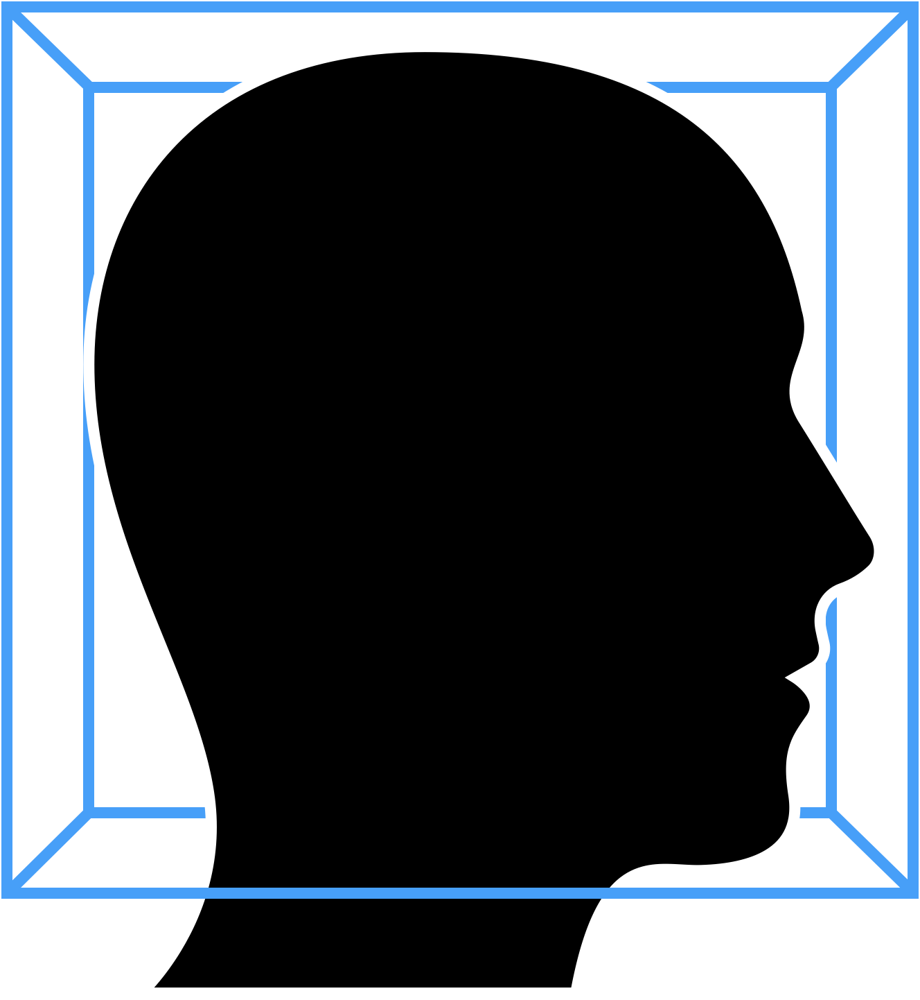

# DomesticatedMind

The domesticated mind emerges when a being makes choices based on fear. This mindset perceives itself as separate from the world and threatened by it, thus seeking control over reality. It views existence as a game theoretic struggle for survival, relying on statistical analysis to navigate a perceived random universe. Disconnected from the perception of goodness and beauty, the domesticated mind focuses solely on truth and facts, losing contact with the heart and the larger reality encompassing the entire spectrum of truth, goodness, and beauty.
With its fundamental mode of operation being paranoia it relentlessly seeks to optimize against uncertainty as it perceives anything unknown as a potential threat.
When domesticated mind encounters a story it uses it like everything else as a tool for its inherent agenda for control. It does so by distorting and engineering a story into a narrative that manipulates those who encounter it in alignment with the agenda.

Example: https://www.youtube.com/shorts/Tu4DaH2MIg4